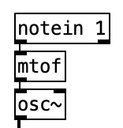
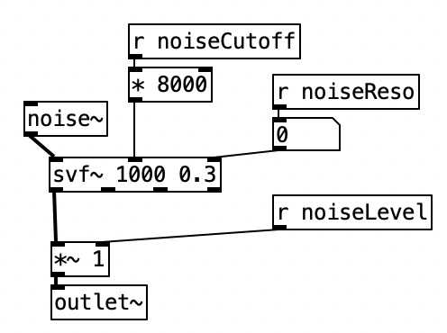
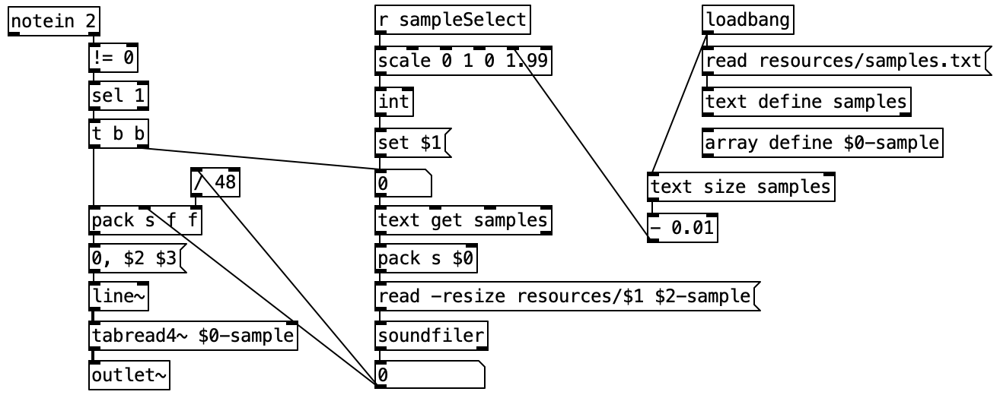
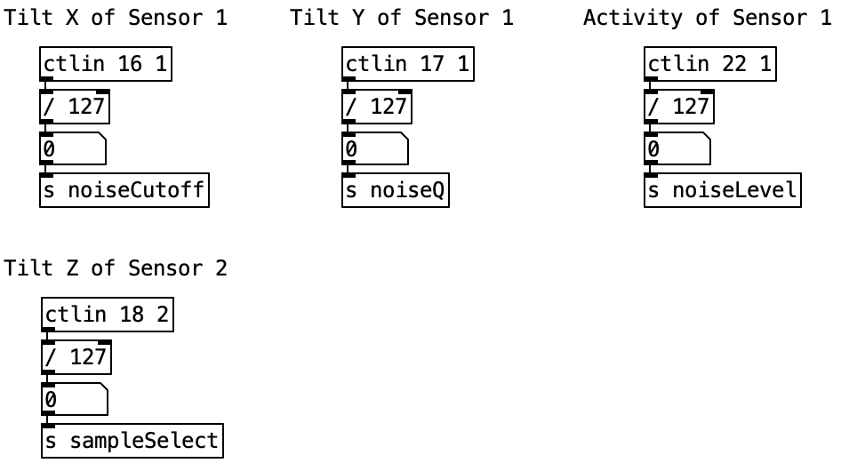

# SOMI-1 Mobile App - Sound Designer Kit (SDK)
This repository is intended to help sound designers, who are familiar with [Pure Data](http://puredata.info), creating their own interactive soundscapes for the SOMI-1 Mobile App based on Instruments of Things® motion sensor platform **SOMI-1**.

## 1. Compatibility
Additionally to Pd Vanilla objects, the SOMI-1 Mobile App offers built-in support for [Cyclone](https://github.com/porres/pd-cyclone) externals. To avoid any compatibility problems, make sure to use the following versions during development:

* Pure Data Vanilla 0.53-1
* Cyclone 0.6-1
* SOMI-1 Mobile App v1.1.0

## 2. Overview
Each soundscape consists of at least a Pure Data patch (.pd) file, a JSON (.json) file and a cover art image. 

**Note: It is assumed that you are familiar with Pure Data, JSON and the SOMI-1 Mobile App / Editor.**

The Pure Data (Pd) files represent the real-time audio and MIDI processing algorithms, whereas the JSON file includes all the meta information required by the SOMI-1 Mobile App. For example, the JSON file includes a description and explanation of the soundscape, exposed sound parameters of the Pd patch, default movement to sound parameter mappings, SOMI-1 hub configuration, etc. 

## 3. Soundscape Directory Structure
Each soundscape has to be located in a dedicated directory with your desired, unique soundscape name. Both, the Pd patch file as well as the JSON file have to have the same filename as the top level directory (with the according extension). The cover art image has to be located in a ***resources*** sub directory and can have an arbitrary name.

**Attention: Avoid dash or space characters in file and directory names!**

Assuming the name of the soundscape is ***demo***, the following listing shows a basic example of the soundscape directory structure:

```bash
demo
├── demo.pd
├── demo.json
├── resources
│   ├── demo_cover.png
```

Additionally to the main Pd patch and JSON file, one can make use of external files, such as Pd abstractions, audio files, text files, etc. Pd abstractions should be located in the same top level directory as the main Pd file. Other external files should be located in the ***resources*** sub directory. The filenames can be freely chosen except dash and space characters.

**Attention: Always use relative paths in your Pure Data patch when referencing external files!**

### Cover Art
For some eye candy in the SOMI-1 Mobile App, soundscapes require a cover art image. Make sure the image is quadratic with at least ***1024x1024*** pixels in ***png*** format. The image file has to be located in the ***resources*** sub directory. The image file is referenced via its filename in the JSON file via the property ***Cover***.

The following listing shows the directory structure of the [demo](demo/) soundscape from this repository, which includes Pd abstractions, audio files and a text file.

```bash
demo
├── demo.pd
├── demo.json
├── sampler.pd
├── testing.pd
├── resources
│   ├── beat.wav
│   ├── demo_cover.png
│   ├── samples.txt
│   ├── somi1.wav
```

## 4. Pure Data Patches
There are no special changes in the usage of Pd Vanilla (and Cyclone) except movement data transmitted from SOMI-1 via MIDI Control Change messages. 

To achieve high precision movement control and to reduce quantization errors while keeping MIDI 1.0 compatibility, SOMI-1 makes use of high precision (14 Bit) Control Change messages, which unfortunately are not supported by Pd Vanilla. Thus, instead of using ***ctlin*** objects of Pd, the SOMI-1 Mobile App uses Pd ***receive (r)*** objects to transmit high-precision (floating point) movement data from SOMI-1 to Pd. In addition to floating point data processing, the Pd receive object offers IDs for referencing, which are used to map movement parameters to sound parameters in the SOMI-1 Mobile App. More details on how to make use of the receive object can be found in the next section.

**Note: Movement data transmitted from SOMI-1 to Pure Data via receive objects is always in normalized range, i.e. between 0.0 and 1.0.**

**Note: For MIDI Note On/Off and Pitch Bend messages, the common Pure Data objects notein and bendin are used.**

## 5. JSON Meta Information File
Now that you know the soundscape directory structure and Pd related characteristics, let's have a deeper look into the structure of a JSON meta information file describing several soundscape properties required by the SOMI-1 Mobile App.

The following listing shows a JSON object containing all top-level properties required by the SOMI-1 Mobile App:

```json
{
    "Name": "Demo",
    "Description": "This is a demo soundscape",
    "Explanation": "This soundscape includes an oscillator, a state variable filter and a sampler controlled via sensor 1 and 2.",
    "Version": "1.0",
    "Author": "Henrik Langer",
    "Email": "contact@instrumentsofthings.com",
    "Year": "2023",
    "License": "CC BY-NC-SA 4.0",
    "Credits": [
        "Pure Data Patch by Sven Miesner"
    ],
    "Cover": "demo_cover.png",
    "Parameter": {},
    "ParameterMappings": [],
    "NoteConfigs": [],
    "PitchBendConfigs": []
}
```

Let's go through each property for a detailed explanation.

* **Name** - Human readable name of the soundscape shown to the user.
* **Description** - Soundscape info text shown in the main view below the cover art.
* **Explanation** - Explanation text shown in the soundscape info view.
* **Version** - Version string shown in the soundscape info view.
* **Author** - Author shown in the soundscape info view.
* **Email** - Email address of the author shown in the soundscape info view.
* **Year** - Release year of this specific soundscape version shown in the soundscape info view.
* **License** - License of this soundscape shown in the soundscape info view.
* **Credits** - Credits to other people whose work is used in this soundscape, such as samples, Pd abstractions, etc. This string array can have more than a single entry, which are shown as bullet points in the soundscape info view.
* **Cover** - Filename of the cover art image located in resources sub directory.
* **Parameter** - The sound parameters or rather macros this soundscape exposes to the user (i.e. the receive object IDs in Pd patch). In the SOMI-1 Mobile App, this allows the user to customize movement to sound parameter mappings.
* **ParameterMappings** - An array containing the factory movement to sound parameter mappings via high resolution MIDI Control Change messages to Pd receive objects. Additionally, each property in this array contains individual movement parameter settings, such as sensitivity, slew limiter, etc.
* **NoteConfigs** - An array containing the factory MIDI Note On/Off settings.
* **PitchBendConfigs** - An array containing the factory MIDI Pitch Bend settings.

### Exposing Parameters from Pure Data Patch
Let's assume we have a ***receive (r)*** object with the ID ***noiseCutoff*** in our Pd patch. To expose this parameter, we have to add an object to the ***Parameter*** property in the JSON file referencing the Pd receive ID (i.e. noiseCutoff) and a human readable name shown to the user (e.g. Cutoff). Furthermore, to keep a good overview in the user interface, Pd patch parameters corresponding to a specific sound or instrument are grouped together. Let's assume the ***noiseCutoff*** parameter belongs to the sound group ***Noise***. 

The following listing shows the ***Parameter*** property in the JSON file exposing the Pd parameter ***noiseCutoff*** shown as ***Cutoff*** to the user belonging to the sound group ***Noise***:

```json
{
    "Parameter": {
        "Noise": [
        {
            "Name": "Cutoff",
            "PDParam": "noiseCutoff"
        }]
    }
}
```

**Note: The SOMI-1 Mobile App allows max. 9 sound groups with max. 9 parameters each.**

### Factory Mappings and MIDI Settings
Each soundscape should be distributed with factory movement to sound parameter mappings and MIDI settings allowing users to get started easily. The JSON file includes the following arrays corresponding to MIDI Control Change (including mapping to exposed Pd parameters defined in ***Parameter*** property), Note On/Off and Pitch Bend settings:

* ParameterMappings
* NoteConfigs
* PitchBendConfigs

**Note: Only movement parameters or rather MIDI settings defined in the JSON file are enabled on the SOMI-1 Hub.**

Before going into detail, let's have a look at the parameter references, which are used in the JSON file.

Sensors are referenced via a unique integer ID starting from 0 (max. 5):
```bash
0 => First Sensor
1 => Second Sensor
...
```

Movement parameters are represented by a unique integer ID starting from 0 (max. 6):
```bash
0 => Tilt X
1 => Tilt Y
2 => Tilt Z
3 => Acceleration X
4 => Acceleration Y
5 => Acceleration Z
6 => Activity
```

MIDI channels start from 0 (max. 15):
```bash
0 => MIDI Channel 1
1 => MIDI Channel 2
...
```


<!-- * Use Pd object *notein* to -->
<!-- ##### What are Slots? -->

The following sections explain each configuration scheme in detail.

#### ParameterMappings (Control Change)
Additionally to MIDI Control Change related settings (e.g. scale) each object in the ParameterMappings array includes the property **PDParam** corresponding the above described exposed Pd parameters representing a factory movement to sound parameter mapping.

**Note: You don't have to create a mapping for each exposed Pure Data parameter. More importantly, the factory mapping should be easy to understand by the user. If desired, users can create additional mappings to other exposed Pure Data parameters directly in the app.**

**Note: The SOMI-1 Mobile App uses high resolution (14 Bit) Control Change messages by default.**

The following listing shows a Control Change mapping object belonging to the **ParameterMappings** array corresponding to the above exposed Pd parameter **noiseCutoff**:

```json
{
    "ParameterMappings": [
    {
        "PDParam": "noiseCutoff",
        "SensorId": 0,
        "SlotIndex": 0,
        "MidiChannel": 0,
        "InputParam": 0,
        "Controller": 16,
        "Scale": 1.0,
        "SlewLimiterShape": 0.5,
        "SlewLimiterRise": 0.0,
        "SlewLimiterFall": 0.0,
        "InverseInputParam": false
    }]
}
```

Let's go through each property for a detailed explanation.

* **PDParam** - Unique ID of Pd parameter exposed in the JSON property *Parameter*.
* **SensorId** - ID of the sensor corresponding to this mapping starting from 0.
* **SlotIndex** - Slot index corresponding to this mapping (currently fixed and corresponding to the input movement parameter index, i.e. *InputParam*).
* **MidiChannel** - MIDI channel starting from 0 (usually represented as 1 by DAWs, etc.). Should be the same as *SensorId*.
* **InputParam** - Index of the movement parameter corresponding to the Control Change controller value, in this case movement parameter *Tilt X*. Should be the same as *SlotIndex*.
* **Controller** - MIDI Control Change controller index. Should start from 16 (general purpose) + index of *InputParam*, i.e. in this case 16 + 0 => 16.
* **Scale** - Scale factor coefficient (i.e. sensitivity) multiplied with the incoming movement parameter value.
* **SlewLimiterShape** - Shape of the built-in slew limiter (0.0 => linear, 1.0 => exponential). Has to be in normalized range, i.e. between 0.0 and 1.0.
* **SlewLimiterRise** - Rise time factor of the built-in slew limiter (0.0 => no slewing applied to rising values, 1.0 => max. slewing applied to rising values). Has to be in normalized range, i.e. between 0.0 and 1.0.
* **SlewLimiterFall** - Fall time factor of the built-in slew limiter (0.0 => no slewing applied to falling values, 1.0 => max. slewing applied to falling values). Has to be in normalized range, i.e. between 0.0 and 1.0.
* **InverseInputParam** - If set to true, inverses the incoming movement parameter value.

#### NoteConfigs (Note On/Off)
The mapping of MIDI Note On/Off messages are designated via the Pd *notein* object in the Pd patch by supplying the MIDI channel as argument to it corresponding to the sensor.

The following listing shows a Note configuration object belonging to the **NoteConfigs** array:

```json
{
    "NoteConfigs": [
    {
        "SensorId": 0,
        "SlotIndex": 0,
        "MidiChannel": 0,
        "InputParamGate": 6,
        "InputParamNote": 2,
        "NoteMin": 36,
        "NoteMax": 60,
        "VelocityNoteOn": 127,
        "VelocityNoteOff": 0,
        "GateThreshold": 0.5,
        "InverseParamGate": false,
        "InverseParamNote": false
    }]
}
```

Let's go through each property for a detailed explanation.

* **SensorId** - The ID of the sensor corresponding to this note configuration.
* **SlotIndex** - The slot index corresponding to this note configuration (currently fixed and should be always 0).
* **MidiChannel** - The MIDI channel starting from 0 (i.e. represented by DAWs, etc. as 1). Should be the same as *SensorId*.
* **InputParamGate** - The index of the movement parameter used to distinguish between Note On/Off (see reference IDs above). In this case movement parameter *Activity*.
* **InputParamNote** - The index of the movement parameter corresponding to note pitch (see reference IDs above). In this case movement parameter *Tilt Z*.
* **NoteMin** - The minimum note pitch in the range between 0 to 127. In this case C1.
* **NoteMax** - The maximum note pitch in the range between 0 to 127. In this case C3.
* **VelocityNoteOn** - The velocity for Note On messages in the range between 0 and 127.
* **VelocityNoteOff** - The velocity for Note Off messages in the range between 0 and 127.
* **GateThreshold** - The threshold to distinguish between Note On and Note Off. An incoming movement parameter value below the threshold corresponds to Note Off, above the value to Note On. Has to be in normalized range.
* **InverseParamGate** - If set to true, inverses the incoming movement parameter corresponding to gate.
* **InverseParamNote** - If set to true, inverses the incoming movement parameter corresponding to note pitch.


#### PitchBendConfigs (Pitch Bend)
The mapping of MIDI Pitch Bend messages are designated via the Pd *bendin* object in the Pd patch by supplying the MIDI channel as argument to it corresponding to the sensor.

**Note: In comparison to MIDI Control Change and Note On/Off messages, Pitch Bend configurations using acceleration parameters as input are bipolar. Thus, in still position the acceleration value corresponds to middle Pitch Bend position similar to a Pitch Bend wheel.**

The following listing shows a Pitch Bend configuration object belonging to the **PitchBendConfigs** array:

```json
{
    "PitchBendConfigs": [
    {
        "SensorId": 0,
        "SlotIndex": 0,
        "MidiChannel": 0,
        "InputParam": 3,
        "Scale": 1.0,
        "InverseInputParam": false
    }]
}
```

Let's go through each property for a detailed explanation.

* **SensorId** - The ID of the sensor corresponding to this pitch bend configuration.
* **SlotIndex** - The slot index corresponding to this pitch bend configuration (currently fixed and should be always 0).
* **MidiChannel** - The MIDI channel starting from 0 (i.e. represented by DAWs, etc. as 1). Should be the same as *SensorId*.
* **InputParam** - The index of the movement parameter corresponding to the pitch bend value (see reference IDs above). In this case movement parameter *Acceleration X*.
* **Scale** - The scale factor coefficient (i.e. sensitivity) multiplied with the incoming movement parameter value.
* **InverseInputParam** - If set to true, inverses the incoming movement parameter value.

## 6. Demo Soundscape
For ease of understanding, a [demo](demo/) soundscape can be found in this repository covering basics, such as handling MIDI Note On/Off and Control Change messages, a sampling technique and testing soundscapes within Pd in real-time. In the following sections, we will go through each soundscape component.

### Handling MIDI Note On/Off Messages
<p align="center">
    
</p>

To make sure MIDI Note On/Off messages of the first sensor are handled only, the corresponding MIDI channel (i.e. 1) is supplied as argument to the *notein* object (keep in mind that SOMI-1 uses a dedicated MIDI channel for each sensor). If the MIDI channel is omitted, Note On/Off messages of all sensors would be handled leading to unwanted behavior. In this case, the note pitch value is used only and converted to the according frequency via the *mtof* object modulating the frequency of a sine oscillator.

### Handling MIDI Control Change Messages via Receive Objects
<p align="center">
    
</p>

In the Pd abstraction *noise*, the output of a noise generator is routed through a state-variable filter (cyclone object *svf~*). The cutoff frequency and resonance are modulated via the receive objects *noiseCutoff* and *noiseReso*. Remember that incoming values from SOMI-1 via receive objects are always in high resolution and normalized. Thus, the values received via *noiseCutoff* are multiplied with 8000 corresponding to a frequency range of 0 to 8000 Hz. The lowpass output of the state-variable filter is multiplied with the *noiseLevel* values to modulate the volume.

### Sampling
<p align="center">
    
</p>

Sampling is a bit more complex as an array is defined and dynamically resized to load different samples from file system during runtime and synchronize incoming MIDI events.

First a text file (.txt) in the soundscape directory has to be created containing the filenames of the audio files separated by a semicolon. In this case, the text file *samples.txt* was created in the resources sub directory. In the right section of the patch, the text file is read into the Pd variable *samples* when opening the patch. Below that, an array is defined with the unique name *$0-sample*.

**Note: The Pd variable *$0* is rendered to a unique, random number for each Pd abstraction. This prevents name conflicts when using the same abstraction several times in the main Pd patch.**

In the middle section, the value from the receive object *sampleSelect* is scaled and converted to an integer to address each index of the audio file name defined in *samples.txt*. In this case, two audio files are used. Thus, the normalized value is scaled to a range from 0 to 1.99.

**Note: Instead of 2, a maximum scale value of 1.99 is used as otherwise the maximum (normalized) incoming value (i.e. 1) would lead to an index out of range.**

Furthermore, to avoid setting the maximum output range of the *scale* object manually to address all samples, the number of entries in the text file is read dynamically when opening the patch and applied to the *scale* object. This allows adding or removing audio files to the sampler via the text file without changing the patch.

**Note: To reduce latency, the pitch value of the *notein* can be used instead of using a receive object to select a sample.**

As MIDI Control Change values are continuously received, but the sample should be only triggered when receiving a MIDI Note On messages, some synchronization is required. Otherwise the currently played sample would be stopped on every new incoming Control Change message. To accomplish this, a number box holding the sample index is updated via a *set* message to prevent the number box outputting a new value on every received Control Change message. When receiving a Note On message, the current value of the number box is outputted, converted to the according audio filename and applied to the array including resizing to match the number of samples of the audio file via the *soundfiler* object. Additionally, the *soundfiler* object outputs the number of samples of the audio file and updates the *pack* object in the left section, where the right inlet corresponds to the sample time in milliseconds.

**Note: As the audio files use a sample rate of 48 kHz, the number of samples is divided by 48 corresponding to the sample time in milliseconds.**

In the left section of the patch, the *notein* object only receives MIDI note messages from channel 2, i.e. the second sensor. As only Note On messages should trigger the sample playback, the velocity value is evaluated where a value not equal 0 is interpreted as a trigger. The *trigger (t)* object is used for synchronization to make sure the audio file is written to the array including resizing before playing back the content of the array.

Lastly, the *pack* object holding the number of samples and sample time of the currently loaded audio file in the array, outputs the values as a list and applies it to the *line~* object. The *line~* object then iterates over each sample of the audio file in the array via the *tabread4~* object.

**Note: As the audio files are dynamically loaded from the filesystem into the Pd array, XRUNs may occur depending on the audio file size. Thus, when using big audio files, a dedicated array holding the audio file should be used to avoid filesystem IO operations.**

### Testing within Pure Data
<p align="center">
    
</p>

To test the patch with real-time movement data from SOMI-1 within the Pd environment while developing, the demo soundscape includes the abstraction *testing*, which converts MIDI Control Change messages to send messages, essentially representing movement to sound parameter mappings, similar to the **ParameterMappings** property in the JSON file without additional processing coefficients.

**Note: Make sure you set SOMI-1 as MIDI input/output device in Pure Data settings.**

**Note: Using *ctlin* objects within Pd only allow low resolution (i.e. 7 Bit) Control Change messages. The SOMI-1 Mobile App uses 14 Bit by default.**

Each *ctlin* object corresponds to a movement parameter of a specific sensor. The movement parameter is selected via a Control Change controller index starting from 16 (i.e. 16=*Tilt X*, 17=*Tilt Y*, etc.). The MIDI channel corresponds to the sensor (i.e. 1=*First Sensor*, 2=*Second Sensor*, etc.).

As SOMI-1 always uses normalized values from receive objects, the Control Change values have to be divided by 127 before sending them to a receive object.

Parallel to Pd processing your soundscape patch and receiving movement data of SOMI-1, you can use the [SOMI-1 Standalone Editor](https://instrumentsofthings.com/pages/support) to set processing coefficients in real-time. This allows experimenting to get everything out of SOMI-1. When satisfied, add your settings to the JSON file (i.e. *ParameterMappings*, *NoteConfigs*, *PitchBendConfigs*).

### Testing with SOMI-1 Testtool
To make sure the soundscape behaves as desired in the SOMI-1 Mobile App, we have created a test tool for Mac OS, which uses the same built-in audio engine as the mobile app ([see releases](https://github.com/instrumentsofthings/SOMI-1-Mobile-App-SDK/releases)).

After your have tested your Pd patch and created the JSON file, compress the soundscape directory as zip archive and load it into the SOMI-1 Testtool. In case there are missing properties or wrong configurations in the JSON file or Pd patch, you will get an according log output in the test tool. 

**Note: You can double click on the log field to copy the log to the system clipboard.**

## 7. Getting Started
When creating your own soundscapes, you can use the [void](void/) soundscape from this repository as a starting point. During development you can continuously test your sound patch within Pd in combination with SOMI-1 and the [SOMI-1 Standalone Editor](https://instrumentsofthings.com/pages/support). This eases finding desired SOMI-1 movement data processing coefficients (e.g. slew limiter). 

## 8. Distribution
At the moment, soundscapes are built-in in the SOMI-1 Mobile App. Thus, if you want to share your soundscape with our community, feel free to send your archived soundscape to us via [email](mailto:support@instrumentsofthings.com), so we can include it in upcoming app releases. In the future, we are planning to allow creators offering their soundscapes as in-app purchases via Apple App Store and Google Play Store.

## 9. Best Practices
* Start with the void soundscape.
* Start easy and continuously test both, the Pd patch and JSON file with the SOMI-1 Testtool ([see releases](https://github.com/instrumentsofthings/SOMI-1-Mobile-App-SDK/releases)) instead of creating a complex Pd patch with dozens of parameters and creating a JSON file afterwards. In our experience, this can lead to annoying issues, such as typos in receive IDs, especially in collaborative projects.
* Use *notein* objects for both, triggering sounds and pitch control instead of receive objects for better latency.
* Use Pd abstractions and include receive objects there instead of inlets for better portability.
* Use processing parameters in JSON file (e.g. scaling, inversion) instead of Pd patch if possible, to allow user customization in the SOMI-1 Mobile App.

## Credits
* Author: Henrik Langer
* Copyright: (c) Instruments of Things GmbH
